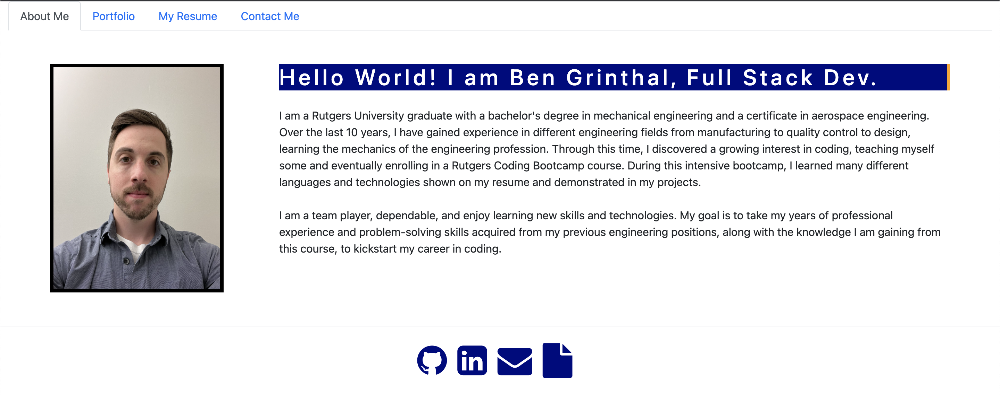

# Ben Grinthal React Portfolio
  
  

  ## Description
  
  - What was your motivation?

  Being a web developer means being part of a community. You’ll need a place not only to share your projects while you're applying for jobs or working as a freelancer but also to share your work with other developers and collaborate on projects.

  Your task is to create a portfolio using your new React skills, which will help set you apart from other developers whose portfolios don’t use the latest technologies.
  
  ## Table of Contents
  
  - [Installation](#installation)
  - [Usage](#usage)
  - [Credits](#credits)
  - [License](#license)
  
  ## Installation
  Run npm install to downloaded neccessary packages.
  
  ## Usage
  Run npm start to open portfolio.
  
  
  ## License

  This application is covered by the MIT license. 
  
  License Link: <a href="https://choosealicense.com/licenses/MIT/">MIT</a>
     
  
  ## How to Contribute
  free to contribute

  ## Tests
  NA

  ## Any Questions?
  -Please contact me through:
  GitHub:  <a href="https://github.com/bgrinthal">bgrinthal</a> 
  Email:   <a href="mailto:bgrinthal@gmail.com">bgrinthal@gmail.com</a>
